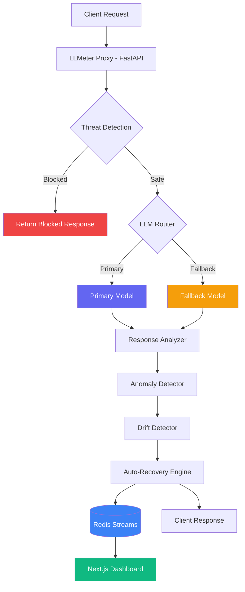

# LLMeter 

> LLMeter sits between your application and any OpenAI-compatible LLM API — scanning every request for threats, tracking latency and error anomalies in real time, detecting output drift using statistical tests, and automatically switching to a fallback model when the primary degrades. Everything is logged to Redis Streams and visualized on a live dashboard.


## Features

- **Threat Detection** — Blocks prompt injection, jailbreak attempts, and sensitive PII before reaching the LLM
- **Anomaly Detection** — Z-score based latency spike detection and sliding window error rate monitoring
- **Output Drift Detection** — Kolmogorov-Smirnov test to detect when LLM response distribution shifts over time
- **Auto-Recovery** — Automatically switches to fallback model when primary model degrades, restores when healthy
- **Real-time Dashboard** — Live metrics, latency chart, drift status, incident log, and recent events

## Architecture



## Tech Stack

| Layer | Tool |
|---|---|
| Proxy & API | FastAPI + uvicorn |
| Event Streaming | Redis Streams |
| Threat Detection | Microsoft Presidio + regex |
| Anomaly Detection | scipy + scikit-learn |
| Drift Detection | Kolmogorov-Smirnov (scipy) |
| Response Analysis | Detoxify |
| Dashboard | Next.js + Recharts + Tailwind |
| Infra | Docker Compose |

## Quick Start

### Prerequisites
- Docker Desktop
- Python 3.11+
- Node.js 18+

### 1. Clone the repo
```bash
git clone https://github.com/yourusername/LLMeter.git
cd LLMeter
```

### 2. Setup environment
```bash
cp .env.example .env
# Add your API key and config to .env
```

### 3. Start with Docker
```bash
docker-compose up -d
```

### 4. Start the dashboard
```bash
cd dashboard
npm install
npm run dev
```

### 5. Open
- **API Docs:** http://localhost:8000/docs
- **Dashboard:** http://localhost:3000

## API Endpoints

| Endpoint | Method | Description |
|---|---|---|
| `/chat` | POST | Send a message through LLMeter proxy |
| `/health` | GET | System health check |
| `/events` | GET | Recent request/response event log |
| `/anomalies` | GET | Current anomaly detection stats |
| `/drift` | GET | Output drift detection status |
| `/recovery` | GET | Auto-recovery and incident log |

## How It Works

**Threat Detection:** Every incoming prompt is scanned for prompt injection patterns and sensitive PII using Microsoft Presidio before reaching the LLM.

**Anomaly Detection:** Latency and error rates are tracked in a sliding window. Z-score analysis flags spikes in real time.

**Drift Detection:** Response lengths are tracked across a reference window and current window. A Kolmogorov-Smirnov test detects statistically significant distribution shifts.

**Auto-Recovery:** When latency or error rate exceeds configured thresholds, the system automatically routes to a fallback model and logs the incident.

## Project Structure

```
LLMeter/
├── proxy/
│   ├── main.py                 # FastAPI app + all endpoints
│   ├── analyzer/
│   │   ├── request.py          # Threat detection
│   │   └── response.py         # Response quality analysis
│   ├── recovery/
│   │   └── engine.py           # Auto-recovery logic
│   └── streaming/
│       └── redis_client.py     # Redis Streams event logging
├── detector/
│   ├── anomaly.py              # Latency + error rate detection
│   └── drift.py                # KS test drift detection
├── dashboard/                  # Next.js real-time dashboard
├── Dockerfile
├── docker-compose.yml
└── .env.example
```

## Configuration

All thresholds are configurable via `.env`:

```bash
LATENCY_THRESHOLD_MS=3000    # Trigger fallback above this latency
ERROR_RATE_THRESHOLD=0.1     # Trigger fallback above 10% error rate
PRIMARY_MODEL=llama-3.1-8b-instant
FALLBACK_MODEL=llama-3.3-70b-versatile
```

